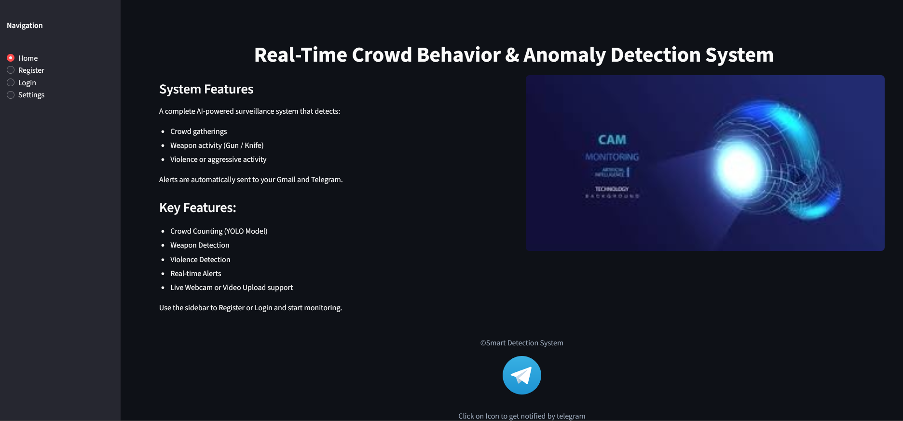
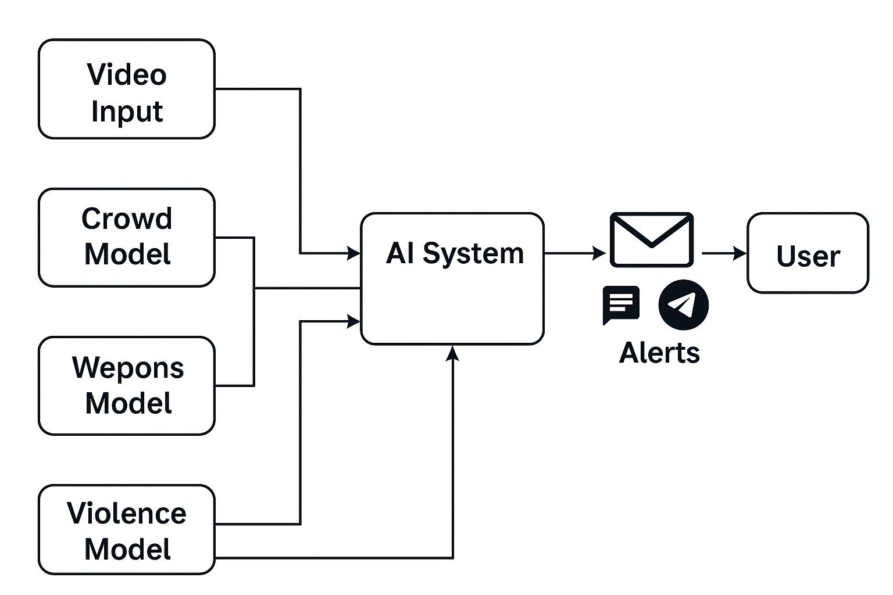

# AI-Alert-System
## Overview
The AI Alert System is a real-time intelligent monitoring application that detects abnormal or critical conditions and triggers immediate alerts. It reduces the need for manual supervision by automatically analyzing incoming data and responding to risk patterns as they occur.

## Key Features
  ⚡ Real-time Monitoring – Continuously observes live input streams
  
  🤖 AI-based Decision Logic – Detects abnormal or risky patterns automatically
  
  🔔 Instant Alerts – generates gmail, Telegram Alerts
  
  🧩 Modular Design – Easy to extend with new rules, models, or data sources

  📈 Scalable Architecture – Can be adapted for small or large-scale systems
## Tech Stack
  1.Programming Language: Python
  
  2.Core Libraries:
  
  3.OpenCV – Video and frame processing 
  
  4.NumPy – Numerical computations
  
  5.scikit-learn ,Custom logic – Pattern or anomaly detection
  
  6.Alert Mechanism: Gmail, Telegram API
  
  7.Streamlit : Deployment
  
## System Architecture

  Input Modules – Captures live data (camera feed / video input)
  
  Preprocessing Module – Cleans and prepares data for analysis
  
  Analysis Engine – Applies AI logic and rules to detect anomalies
  
  Decision Module – Evaluates thresholds and conditions
  
  Alert Module – Triggers alerts when abnormal behavior is detected
  
## Use Cases
  🛡️ Security & Surveillance – Detects suspicious activity
  
  🏭 Workplace Safety Monitoring – Alerts during unsafe conditions
  
  🏙️ Smart Monitoring Systems – Supports automation and smart environments
  
  💻 System & Process Monitoring – Detects abnormal system behavior
  
## Future Enhancements
  🤖 Advanced machine learning / deep learning integration
  
  📊 Alert analytics and reporting dashboard
  
  ☁️ Cloud-based alert notifications (Email / SMS )
  
  🔗 Integration with IoT devices and sensors

